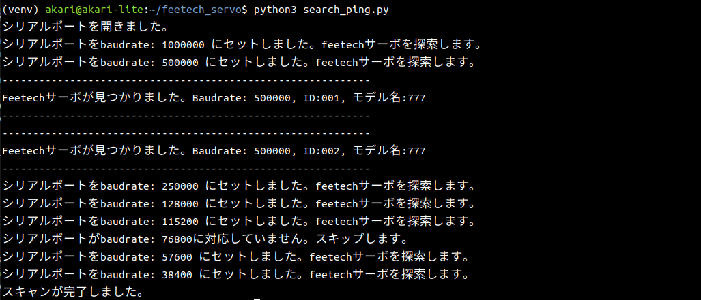
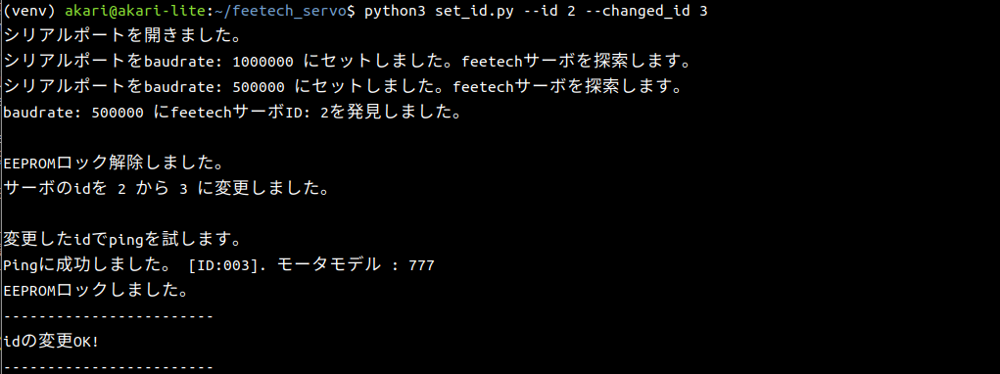
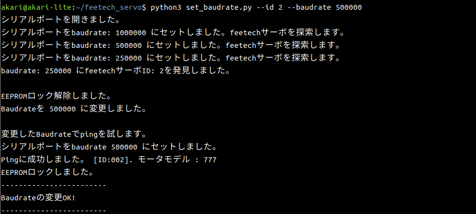
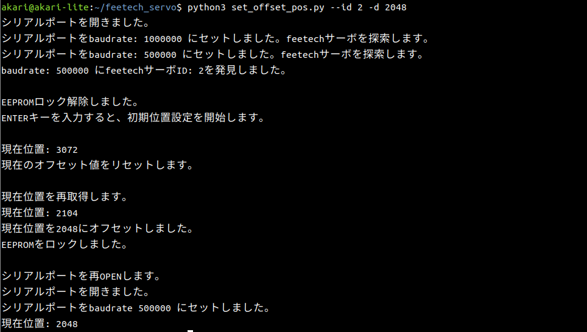
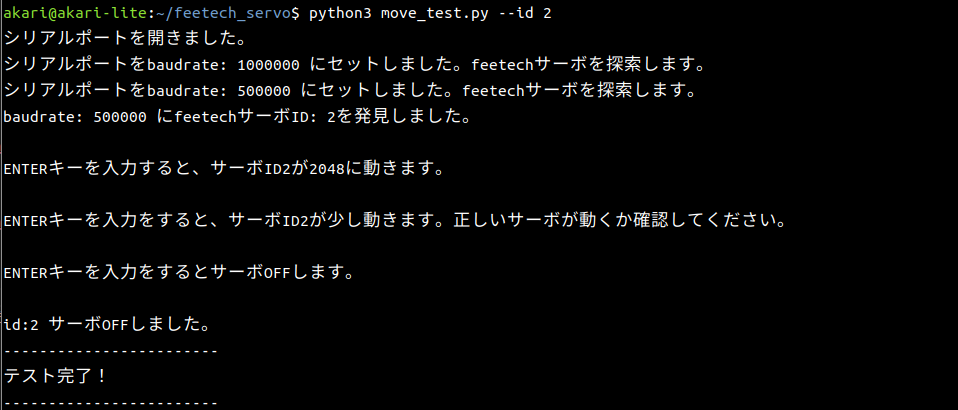

# feetech-setup
シリアルバスのfeetechサーボのセッティングをCUI上で行うためのスクリプト

## 動作確認済み環境
最低限下記の環境では動作確認済み。
- Raspberry pi 4
- Ubuntu MATE 22.04
- feetech STS3032, feetech STS3215

## セットアップ
`pip install python3.10 python3.10-venv`
`python3 -m venv venv`
`pip install feetech-servo-sdk`

## 使用方法
### 接続されているfeetechサーボの探索
`python3 search_ping.py`

指定したシリアルポートに接続されているfeetechサーボをスキャンして表示する。
各baudrate、idに対して順番にスキャンを行う。
引数
`-p` `--port`: feetechが接続されたシリアルポートを指定。デフォルトは`/dev/serial0`
`-s` `--search_id`: 最大で探索するサーボID。デフォルトは10で、0~10までのIDを探索する。

### IDの変更
`python3 set_id.py`

feetechサーボのサーボIDを変更する。
引数
`-p` `--port`: feetechが接続されたシリアルポートを指定。デフォルトは`/dev/serial0`
`-i` `--id`: 変更したいfeetechサーボの現在のIDを指定する。
`-c` `--changed_id`: 変更したいfeetechサーボの変更後のIDを指定する。

### Baudrateの変更
`python3 set_baudrate.py`

feetechサーボのBaudrateを変更する。
引数
`-p` `--port`: feetechが接続されたシリアルポートを指定。デフォルトは`/dev/serial0`
`-i` `--id`: 変更したいfeetechサーボのIDを指定する。
`-b` `--baudrate`: 変更したいfeetechサーボの変更後のBaudrateを指定する。

### 位置オフセットの変更
`python3 set_offset_pos.py`

feetechサーボの位置オフセットを変更する。
引数
`-p` `--port`: feetechが接続されたシリアルポートを指定。デフォルトは`/dev/serial0`
`-i` `--id`: 変更したいfeetechサーボのIDを指定する。
`-d` `--default_pos`: 現在のサーボの位置をここで入力した値になるようにオフセット値を変更する。デフォルトは2048。

### 現在位置の取得
`python3 get_cur_pos.py`

feetechサーボの位置オフセットを変更する。
引数
`-p` `--port`: feetechが接続されたシリアルポートを指定。デフォルトは`/dev/serial0`
`-i` `--id`: 現在位置を取得したいfeetechサーボのIDを指定する。

### 動作テスト
`python3 move_test.py`

feetechサーボの動作テストをする。指定の位置まで移動したあと、少し動きます。
引数
`-p` `--port`: feetechが接続されたシリアルポートを指定。デフォルトは`/dev/serial0`
`-i` `--id`: 動作テストしたいfeetechサーボのIDを指定する。
`-m` `--move_pos`: テストで移動する初期位置を指定する。デフォルトは2048。
